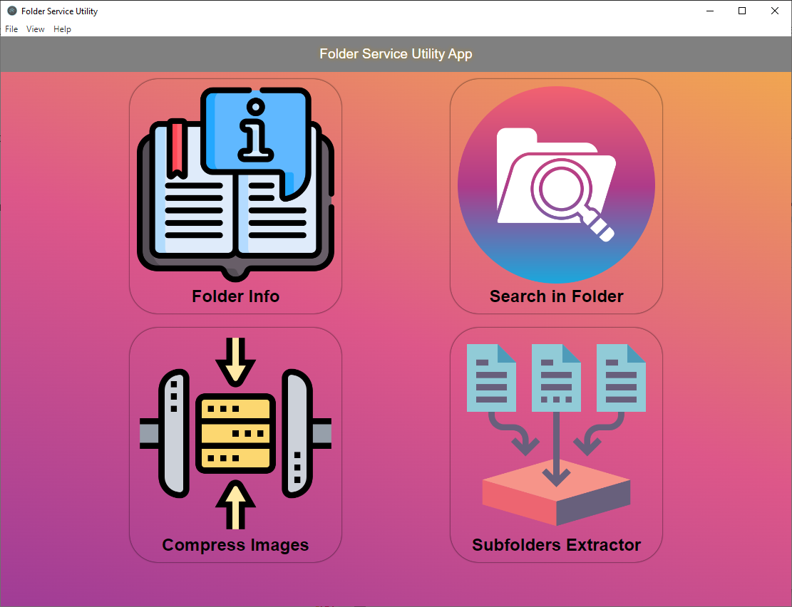
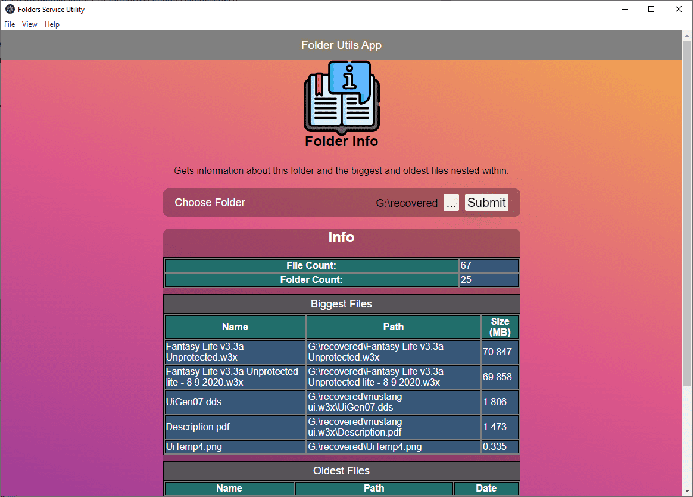
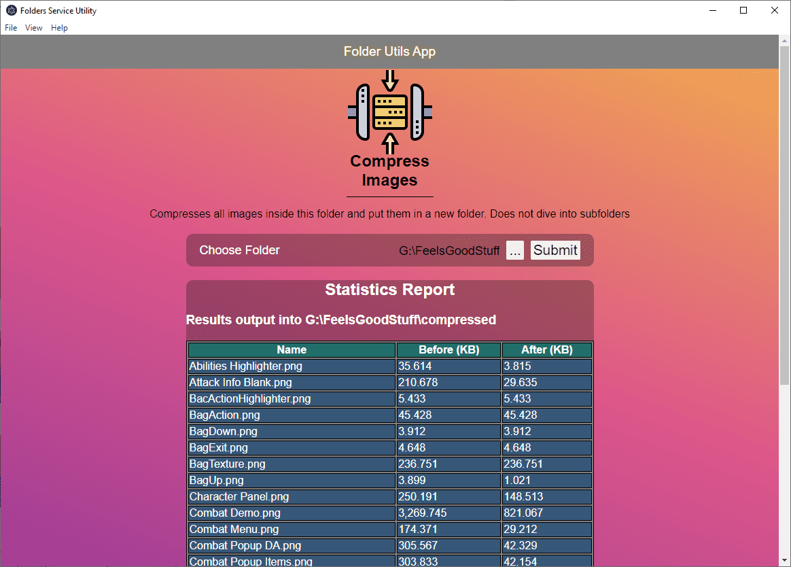
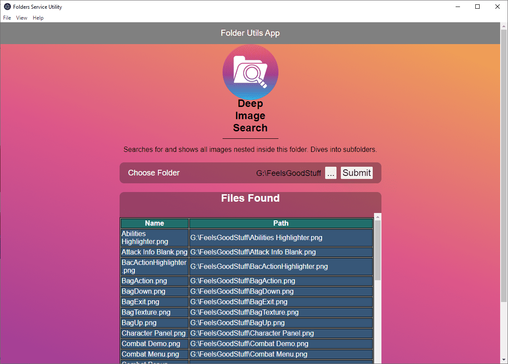
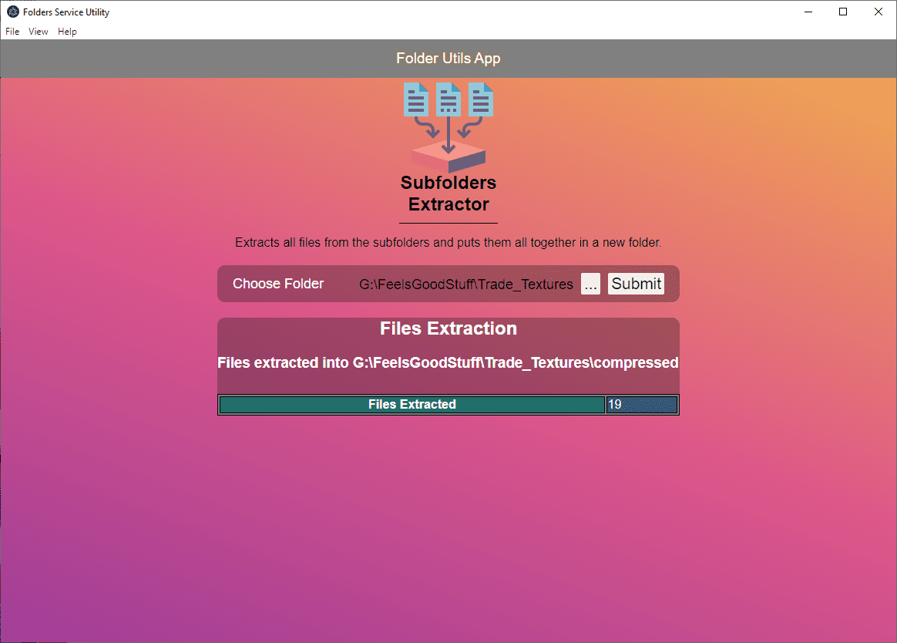

# Folders Services Utility Application


A desktop application that performs multiple different functionalities on desktop folders. View information about your folder, compress images within, gather all deeply nested files within in a single place, and more.

<p align="center">

</p>
Uses Electron.js to be a desktop application, React & TypeScript for the frontend, and Node.js for the backend functionalities.

## Features
What you can do with this application:

- View the number of all folders and files within a specific folder, including deeply nested items.
- View the biggest files and the oldest files nested within a folder, no matter how deeply nested it is.
- Quickly and efficiently compress all images that are directly inside a folder, and show the compression statistics.
- Easily search for and show all images nested within a folder. Helpful if you are looking for hidden or deeply nested images.
- Extract all files from a folder's subfolders and its nested subfolders, and put them all into 1 place without being isolated in different folders.

## Demo
<p align="center">
<iframe width="560" height="315" src="https://www.youtube.com/embed/9JJ2meowozg" title="YouTube video player" frameborder="0" allow="accelerometer; autoplay; clipboard-write; encrypted-media; gyroscope; picture-in-picture" allowfullscreen></iframe>
</p>



## Getting Started
To start using the application, simply head over to the github releases in the github page and download the app's zip file.

## Development

### Prerequisites

- Node.js & npm.

### Installing
Simply clone the repo, then run
```npm install```
to install.

### Starting the app
Run the command 
``` npm start```
to start the development server and open up the application. Any updates done will refresh the application.

### Build & Package the app
Run the command 
``` npm run package```
to package the application and get distributions ready to be served and distributed.

## Contributing
All contributions are welcome. Feel free to start an issue and to fork and pull request.

## Authors

  - **Ahmed Atwa**
